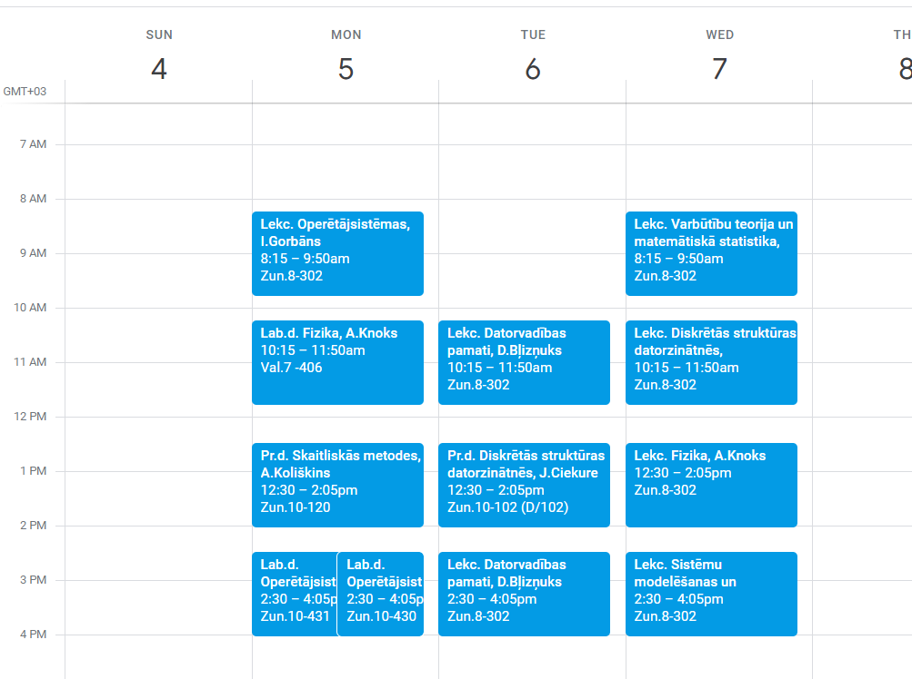

# RTU Calendar Scraper
<!-- ALL-CONTRIBUTORS-BADGE:START - Do not remove or modify this section -->
[](#contributors-)
<!-- ALL-CONTRIBUTORS-BADGE:END -->

Creates a .csv file from the timetable at https://nodarbibas.rtu.lv/, so you can add it to your google calendar or whatever. Currently scrapes from 2022 September to December, might update in the future to include changing dates.

Bottom text

## Usage

1. Install Python from [here](https://www.python.org/downloads/)

> Tested only on Python version 3.10.2 and Windows 10

2. Run all of this shit in a command prompt

```sh
# Clone the repository with git (or just download it as a zip file and extract)
git clone https://github.com/tomszir/rtu-calendar-scraper

# Navigate to the project directory
cd rtu-calendar-scraper

# Install python requirements
pip install -r requirements.txt

# Run the scraper tool and follow prompts
py ./main.py
```

3. Import the csv file into Google Calendar or whatever other app you're using (have not tested on anything else)

## Proof

In case you don't believe this shit works here's the schedule I imported for myself. The only reason I made this shit was so I could get a reminder when I might actually have to do something



## Contributors

<!-- ALL-CONTRIBUTORS-LIST:START - Do not remove or modify this section -->
<!-- prettier-ignore-start -->
<!-- markdownlint-disable -->
<table>
  <tbody>
    <tr>
      <td align="center"><a href="https://github.com/Wolferado"><br /><sub><b>Aleksey Karelin</b></sub></a><br /><a href="https://github.com/tomszir/rtu-calendar-scraper/commits?author=Wolferado" title="Code">💻</a></td>
      <td align="center"><a href="https://github.com/arturskovrigo"><br /><sub><b>arturskovrigo</b></sub></a><br /><a href="https://github.com/tomszir/rtu-calendar-scraper/issues?q=author%3Aarturskovrigo" title="Bug reports">🐛</a> <a href="https://github.com/tomszir/rtu-calendar-scraper/commits?author=arturskovrigo" title="Code">💻</a></td>
    </tr>
  </tbody>
</table>

<!-- markdownlint-restore -->
<!-- prettier-ignore-end -->

<!-- ALL-CONTRIBUTORS-LIST:END -->
<!-- prettier-ignore-start -->
<!-- markdownlint-disable -->

<!-- markdownlint-restore -->
<!-- prettier-ignore-end -->

<!-- ALL-CONTRIBUTORS-LIST:END -->

## License

Do whatever you want with this
